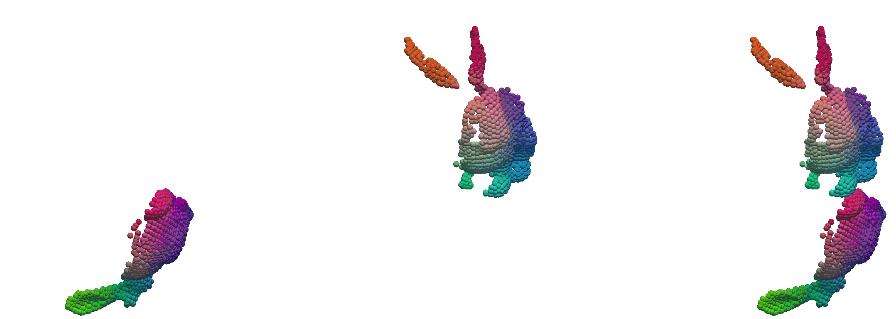
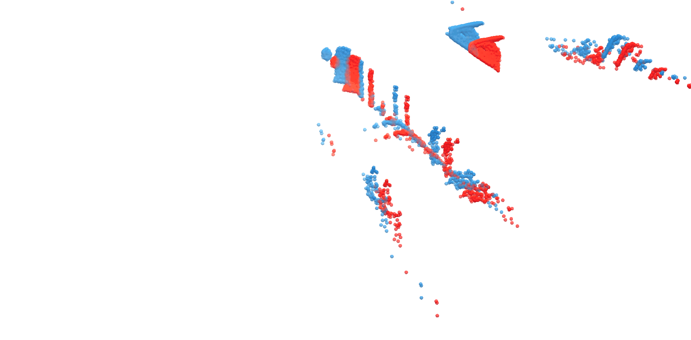

## Shapmagn

This is the repository for the paper "Accurate Point Cloud Registration with Robust Optimal Transport" (coming soon).

The repository provides a general framework for the point cloud/mesh registration, supporting both optimization and learning
based registration approaches.  It also provides a general framework for deep prediction tasks, e.g. 3D landmark detection. 

### Supported Approach list:

####Optimization-based approaches:
1. Spline registration (support anisotropic kernel)
2. Fluid registration (support LDDMM)
3. Coherent Point Drift
4. Robust Optimal Transport (RobOT)
5. RobOT Projection (rigid, spline, LDDMM)
6. RobOT based uniform mass sampling
7. Thirdparty approaches (Probreg, Open3d, Teaser++)


####Deep learning based registration approaches:
1. Spline registration (support anisotropic kernel)
2. Fluid registration (support LDDMM)
3. Point cloud feature learning (self-supervised)
4. end-to-end registration (prealign, spline/LDDMM, postprocessing)

####Deep learning based other approaches:
1. Landmark Detection


## Instalation


For detailed instructions refer to [INSTALL.md](INSTALL.md).

## Demo
We provide a series of demos, which can be found at shapmagn/demos
Here are two examples on how to run the optimization-based demos :

### Optimization demos
```
cd shapmagn/shapmagn/demos
python 2d_toy_reg.py
python ot_fun.py
python toy_reg.py
python partial_prealign_reg.py
python lung_gradient_flow.py
python lung_reg.py
python flyingkitti_reg.py
python ot_sampling.py
```

### Deep demo on Lung vessel tree

Here is an example on deep feature learning on lung vessel dataset:
```
python run_task.py -ds ./demos/data/lung_data/lung_dataset_splits -o ./demos/output/training_feature_learning_on_one_case -tn deepfeature_pointconv_train -ts ./demos/settings/lung/deep_feature_training -g 0
```

Here is an example on robust optimal transport based deep feature projection (spline) on lung vessel dataset:
```
python run_eval.py -dj ./demos/data/lung_data/lung_dataset_splits/test/pair_data.json -o ./demos/output/test_feature_projection_one_case/deepfeature_pointconv_projection -ts ./demos/settings/lung/deep_feature_projection -g 0
```

Here is an example on training a pretrained deep LDDMM flow network on one real pair:

```
python run_task.py  -ds ./demos/data/lung_data/lung_dataset_splits -o ./demos/output/train_deepflow_on_one_case -tn deepflow_pwc_lddmm -ts ./demos/settings/lung/deep_lddmm_flow   -g 0
```

Here is an example on evaluating a pretrained deep LDDMM flow network on one real pair:

```
python run_eval.py -dj ./demos/data/lung_data/lung_dataset_splits/test/pair_data.json -o ./demos/output/test_deepflow_on_one_case/deepflow_pwc_lddmm -ts ./demos/settings/lung/deep_lddmm_flow  -m   ./demos/pretrained_models/lung_model/pretrained_deep_lddmm -g 0
```

### Deep demo on Kitti

#### Prepare Kitti data
We need prepare the data of KITTI Scene Flow 2015 first. Here we follow the instruction in [PointPWC](https://github.com/DylanWusee/PointPWC).

Download and unzip [KITTI Scene Flow Evaluation 2015](http://www.cvlibs.net/download.php?file=data_scene_flow.zip) to directory `RAW_DATA_PATH`.
Run the following script for kitti data preprocessing, the processed data are saved in `PROCESSED_DATA_PATH`; A shapmagn compatible format is saved in `SHAPMAN_INTPUT_PATH`:

```
cd shapmagn/experiments/datasets/flying3d_and_kitti/flyingkitti_nonocc
python process_kitti_raw_data.py RAW_DATA_PATH PROCESSED_DATA_PATH
python prepare_data_test_on_kitti.py RAW_DATA_PATH PROCESSED_DATA_PATH SHAPMAN_INTPUT_PATH
```

Here is an example on evaluating a spline flow network on 142 Kitti pairs:

```
python run_eval.py -dj SHAPMAN_INTPUT_PATH/pair_data.json -o ./demos/output/test_deepflow_on_kitti/deep_spline -ts ./demos/settings/kitti/deep_spline_flow  -m ./demos/pretrained_models/kitti_model/pretrained_deep_spline -g 0
```

Here is an example on evaluating a displacement network(PWC) that combined ot prealigned and ot postprocessing on 142 Kitti pairs:
```
python run_eval.py -dj SHAPMAN_INTPUT_PATH/pair_data.json -o ./demos/output/test_deepflow_on_kitti/deep_pwc -ts ./demos/settings/kitti/official_released_pwc_model_with_ot_prealigned_and_post  -m ./demos/pretrained_models/kitti_model/PointConv_726_0.0463.pth -g 0
```

## Gallery

Here are some examples on supported functions:

**[Robust Optimal Transport (RobOT)](shapmagn/demos/ot_fun.py)**:


**[RobOT Projection (Partial Rigid Registration)](shapmagn/demos/partial_prealign_reg.py)**:
  

**[RobOT Projection (Spline, LDDMM)](shapmagn/demos/toy_reg.py)**:
  

**Lung vessel Registration**:
  
 
**[Scene Flow Estimation](shapmagn/demos/flyingkitti_reg.py)**:
  

**Self-supervised Feature Learning**:
  
 
**[Synthesized Data Pair Generation](shapmagn/experiments/datasets/lung/lung_data_aug.py)**:
  
